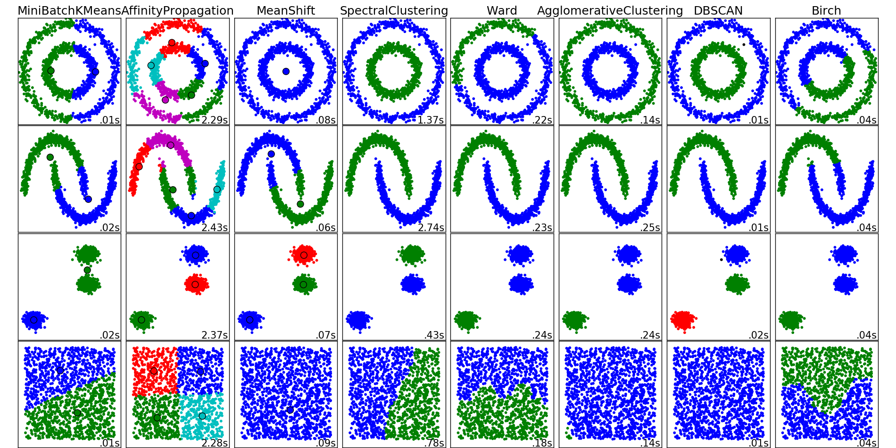

# Predicting Whether Demand for a Product is Favorable to Price Increases

### Prepared by: Jonathan Grotts

### Dataset: Online Retail.xlsx

### Date: 12/22/2016 


---


# Contents

* Purpose
* Demand curve refresher
* Data cleaning
* Summary statistics
* Clustering
* Prediction
* Conclusions

---

# Original prompt

The goal is to estimate the impact of price on customer purchase by country and product purchase.


---

# Purpose

Based on sales data, determine if we can predict whether the demand for a product will be unaffected or favorable after a price increase. Items will be classified into "price change favorable" and "price change unfavorable" and then we will see if country and/or product description can predict this grouping. 


---

# Demand curve


* Elasticity = (% Change in Quantity)/(% Change in Price)
* Price elasticity of demand is responsiveness of the quantity demanded of a good to a change in its price.

---


```{r Load_Data, echo=FALSE, warning = FALSE}
#######################################################
#~~~~~~~~~~~~~~~~~~~~~~~~~~~~~~~~~~~~~~~~~~~~~~~~~
# slide layout
#  - Contents
#  - Purpose
#  - Data cleaning
#  - Summary Statistics
#  - Results
#  - Conclusions
#
#
#  Goal of the analysis: 
#   -  goal is to estimate the impact of price on 
#       customer purchase by country and
#       product purchase
#~~~~~~~~~~~~~~~~~~~~~~~~~~~~~~~~~~~~~~~~~~~~~~~~~
#######################################################


#Load packages
suppressPackageStartupMessages(library(knitr))
suppressPackageStartupMessages(library(sqldf))
suppressPackageStartupMessages(library(glmnet))
suppressPackageStartupMessages(library(pROC))
suppressPackageStartupMessages(library(tm))
suppressPackageStartupMessages(library(wordcloud))
suppressPackageStartupMessages(library(caret))
suppressPackageStartupMessages(library(randomForest))
suppressPackageStartupMessages(library(kernlab))
suppressPackageStartupMessages(library(gbm))
suppressPackageStartupMessages(library(rpart))
suppressPackageStartupMessages(library(MASS))
suppressPackageStartupMessages(library(plyr))
suppressPackageStartupMessages(library(tcltk))

#Load original data
retail <- read.csv("Online Retail.csv")
retail$InvoiceDate <- as.POSIXct(retail$InvoiceDate,format="%d/%m/%Y %H:%M")

#~~~~~~~~~~~~~~~~~~~~~~~~~~~~~~~~~~~~~~~~~~~~~~~~~~~~~~~~
#Read retail normalized
# dataset formatted in file format_retail_norm.r
# Feature extraction was done in this dataset
#~~~~~~~~~~~~~~~~~~~~~~~~~~~~~~~~~~~~~~~~~~~~~~~~~~~~~~~
retail_norm <- read.csv("retail_norm.csv")

# Format for quant_price_ratio
retail_norm$quant_price_ratio <- retail_norm$quant_range_normalized/
                                  retail_norm$price_range_normalized


#~~~~~~~~~~~~~~~~~~~~~~~~~~~~~~~~~~~~~~~~~~~~~~~~~~~~~~~
# Create n's for summary statistics
#~~~~~~~~~~~~~~~~~~~~~~~~~~~~~~~~~~~~~~~~~~~~~~~~~~~~~~~
#Remove country == "Unspecified"
n_unspecified_removed <- as.numeric(sqldf("SELECT COUNT(*) from retail where Country = 'Unspecified'"))
retail <- sqldf("select * from retail where Country != 'Unspecified'")

#Remove negative prices
n_removed_price <- as.numeric(sqldf("SELECT COUNT(*) from retail where (UnitPrice < 0)"))
retail <- sqldf("select * from retail where UnitPrice > 0")

#Remove bogus quantities 
n_removed_quantity_neg <- as.numeric(sqldf("SELECT COUNT(*) from retail where (Quantity < 0)"))
n_removed_quantity_pos <- as.numeric(sqldf("SELECT COUNT(*) from retail where (Quantity > 10000)"))
retail <- sqldf("select * from retail where (Quantity > 0 and Quantity < 10000)")


n_items_removed <- length(unique(retail$StockCode)) - dim(retail_norm)[1]


# head(retail)
```


---

# Data cleaning

Datasource: This is a transnational data set which contains all transactions for a UK-based online retailer. The company mainly sells unique all-occasion gifts. Many customers of the company are wholesalers.

Dataset contained:

* Unique invoice number
* Unique item number
* Description of product
* Quantity of product sold
* Invoice date
* Price
* Country of sale


---

# Data cleaning

* `r n_removed_price` orders were removed because of negative price.
* `r n_unspecified_removed` orders were removed because of 'Unspecified' country.
* `r n_removed_quantity_neg` orders were removed because of negative quantities. `r n_removed_quantity_pos` were removed because quantity was extreme outlier. These values had a quantity of approximately 81,000 and the next closest order was 4,800.
* Large price outliers were investigated and left in the dataset because there was no clear indication that these were data entry errors. Also, considered removing items with descriptions like "AMAZON FEE", "Adjust bad debt", "Postage", and "Manual", but these items were left in for the analysis.
* Products with only one price were removed from the analysis because a demand curve could not be drawn (n = `r n_items_removed`).


```{r Summary_Statistics, summary_statistics, echo=FALSE, warning=FALSE}
n_print <- function(num_hold){
  
  #~~~~~~~~~~~~~~~~~~~~~~~~~~~~~~~~~~~~~~~~~~~~~~~~~~~~~~~~~~~~~~~~~~~~~~~
  # function to print numbers with comma and makes sure
  #  not in scientific notation
  #  
  #  Inputs:
  #   num_hold: sinlge number
  #  Outputs:
  #   character in formatted version 
  #  Note:
  #   Just single number for printing, doesnt work well w vector
  #~~~~~~~~~~~~~~~~~~~~~~~~~~~~~~~~~~~~~~~~~~~~~~~~~~~~~~~~~~~~~~~~~~~~~~~
  
  return(
    format(num_hold,big.mark=",",scientific=FALSE)
  )
}


#Pulling basic Summary statistics
n_countries <- n_print(as.numeric(sqldf("SELECT COUNT(DISTINCT Country) from retail")))
n_customers <- n_print(as.numeric(sqldf("SELECT COUNT(DISTINCT CustomerID) from retail")))
n_items     <- n_print(as.numeric(sqldf("SELECT COUNT(DISTINCT StockCode) from retail")))
n_orders    <- n_print(as.numeric(sqldf("SELECT COUNT(DISTINCT InvoiceNo) from retail")))
# n_tot_ord   <- n_print(as.numeric(sqldf("SELECT COUNT(*) from retail")))
date_range  <- format(range(retail$InvoiceDate, na.rm=T),"%d/%m/%Y")
n_missing_date <- n_print(as.numeric(sqldf("SELECT COUNT(*) from retail where InvoiceDate is null")))
n_missing_custID <- n_print(as.numeric(sqldf("SELECT COUNT(*) from retail where CustomerID is null")))

```

---

# Summary Statistics

* There were `r n_countries` countries in the dataset.
* There were `r n_customers` customers in the dataset. There were `r n_missing_custID` orders missing a customer ID. 
* There were `r n_items` unique items in the dataset.
* There were `r n_orders` unique orders in the dataset. 
* The date range for the orders was `r date_range[1]` - `r date_range[2]`. There were `r n_missing_date` items missing an order date.

---

# Summary Statistics

* [Shiny app](https://datadigressions.shinyapps.io/Retail_Summary_Statistics/)


---

# Feature Extraction

* Price range (normalized)
* Quantity range (normalized)
* Demand curve slope (normalized)
* Proxy for seasonality of item sold: interquartile range of the scaled number of quantities by month
* Median price, mean price, median quantity, mean quantity
* Country the item sold in
* Keyword from description of item


---


# Word cloud of keywords in item description

```{r wordcloud, echo=FALSE, warning=FALSE, fig.height = 10, fig.width = 10}
####################################################
# Simple word cloud
####################################################

item_desc <- VCorpus(VectorSource(retail_norm$Description))
item_desc <- tm_map(item_desc, content_transformer(tolower)) # convert to lower case
item_desc <- tm_map(item_desc, removeWords, stopwords("english")) #removes stopwords
item_desc <- tm_map(item_desc, stripWhitespace) # Remove extra white space
item_desc <- tm_map(item_desc, stemDocument) # Stemming

dtm <- DocumentTermMatrix(item_desc)


freq_terms <- findFreqTerms(dtm,50)

freq <- colSums(as.matrix(dtm))   
ord <- order(freq) 
# freq[tail(ord, n = 25)]  


# writeLines(as.character(item_desc[[2]]))

set.seed(142)   
wordcloud(names(freq), freq, min.freq=25, scale=c(5, .1), colors=brewer.pal(7,"Blues"))   

```


```{r, echo=FALSE, warning=FALSE, fig.height = 8, fig.width = 8}
###################################################
#Creating variable in dataset for top keywords
###################################################
keyword <- names(freq[tail(ord, n = 15)])


retail_norm <- data.frame(
          retail_norm,
          as.matrix(dtm[,keyword])
)


```


---

# Labelling products favorable to price change

Steps: 

* Explore the data
* Compare clustering algorithms
* Apply clustering algorithms


---


# Labelling example 1

* Obvious example of wanting to label this product as "price change favorable"

```{r, echo=FALSE, warning = FALSE, fig.height = 8, fig.width = 8}
#Summary function for plotting behavior of price and quantity within items

price_fun <- function(item_hold){
  
  item_hold <- as.character(item_hold)
  
  price_dat <- NULL
  for(price in unique(retail$UnitPrice[retail$StockCode == item_hold])){
      
      price_dat <- rbind(price_dat,
        data.frame(
          price,
          quantity = sum(retail$Quantity[retail$UnitPrice == price & retail$StockCode == item_hold])
        ))
  }
  
  plot(price_dat$price, price_dat$quantity, 
        xlab = "Price", ylab = "Quantity",
        main = paste("Quantity sold by price of item\n (",
                      as.character(retail$Description[retail$StockCode == item_hold][1]),
                ")",sep=""))
  abline(lsfit(price_dat$price, price_dat$quantity), col = 2)
  mtext(paste("Robust slope =",
      round(retail_norm$norm_slope_rob[retail_norm$StockCode == item_hold],2),"",
    "        quantity range / price range = ",
      round(retail_norm$quant_range_normalized[retail_norm$StockCode == item_hold]/
          retail_norm$price_range_normalized[retail_norm$StockCode == item_hold],2)),
    side = 1, line = 4, cex = 0.75)


  
}

#Obvious price change didn't decrease demand
item_hold <- retail_norm$StockCode[retail_norm$normalized_slope > 0.2][7]
price_fun(item_hold)


```

---

# Labelling example 2

* Obvious example of price change unfavorable

```{r, echo=FALSE, warning = FALSE, fig.height = 8, fig.width = 8}

#Obvious price change decreased demand

item_hold <- retail_norm$StockCode[retail_norm$norm_slope_rob < -0.6][2]
price_fun(item_hold)


```


---

# Labelling example 3

* Unobvious scenario

```{r, echo=FALSE, warning = FALSE, fig.height = 8, fig.width = 8}

#Unobvious situation

item_hold <- retail_norm$StockCode[retail_norm$norm_slope_rob > -0.2][8]
price_fun(item_hold)


```


---

# Labelling example 4

* Unobvious scenario


```{r, echo=FALSE, warning = FALSE, fig.height = 8, fig.width = 8}

#Unobvious situation

item_hold <- retail_norm$StockCode[retail_norm$norm_slope_rob > -0.2 & 
                                    retail_norm$quant_price_ratio > 0.8 & 
                                    retail_norm$quant_price_ratio < 1.2][10]
price_fun(item_hold)


```


---

# Which clustering algorithm to choose?!



---

## Distribution of demand curve slope and the ratio of quantity to price

```{r, echo=FALSE, warning = FALSE, fig.height = 8, fig.width = 8}
plot(retail_norm$norm_slope_rob,
  (retail_norm$quant_range_normalized/
          retail_norm$price_range_normalized),
  ylim = c(0.62,1.5), xlim = c(-1, 1),
  xlab = "Items demand curve slope",
  ylab = "Items range of quantity over range of price",
  main = "")


```

---

# Kmean clustering 

```{r, echo=FALSE, warning = FALSE, fig.height = 8, fig.width = 8}
###################################################################
# Run kmeans
###################################################################
set.seed(15)


clusters_k <- kmeans(dist(retail_norm[, c("quant_price_ratio","norm_slope_rob")]),
                   centers = 2)

# clusters_k <- kmeans(dist(retail_norm[, c("quant_price_ratio")]),
#                    centers = 4)


plot(retail_norm$norm_slope_rob[clusters_k$cluster == 1],
      retail_norm$quant_price_ratio[clusters_k$cluster == 1],
    ylim = c(0.62,1.5), xlim = c(-1, 1), col = 1,
    xlab = "Item's demand curve slope",
    ylab = "Item's range of quantity over range of price",
    main = "")
points(retail_norm$norm_slope_rob[clusters_k$cluster == 2],
      retail_norm$quant_price_ratio[clusters_k$cluster == 2], col = 2)


```

---

# Hierarchical clustering

```{r, echo=FALSE, warning = FALSE, fig.height = 8, fig.width = 8}
###################################################################
# Run heirarchical clustering
###################################################################

clusters <- hclust(dist(retail_norm[, c("quant_price_ratio","norm_slope_rob")]), method = "ward.D")

plot(clusters, hang=-1, xlab = " ", sub = "")

```

---

# Hierarchical clustering (partitions)

```{r, echo=FALSE, warning = FALSE, fig.height = 8, fig.width = 8}


plot(clusters, hang=-1, xlab = " ", sub = "")
rect.hclust(clusters, k=2, border="red") # draw dendogram with red borders around the 5 clusters


```

---

# Hierarchical clustering groups


```{r, echo=FALSE, warning = FALSE, fig.height = 8, fig.width = 8}
#Plot clusters
clusterCut <- cutree(clusters, 2)

# plot(retail_norm$norm_slope_rob[clusterCut == 3 | clusterCut == 4],
#       retail_norm$quant_price_ratio[clusterCut == 3 | clusterCut == 4],
#     ylim = c(0.62,1.5), xlim = c(-1, 1),
#     xlab = "Item's demand curve slope",
#     ylab = "Item's range of quantity over range of price",
#     main = "Heirarchical clustering")
# points(retail_norm$norm_slope_rob[clusterCut == 2 | clusterCut == 1],
#       retail_norm$quant_price_ratio[clusterCut == 2 | clusterCut == 1], col = 2, pch = 1)


plot(retail_norm$norm_slope_rob[clusterCut == 1],
      retail_norm$quant_price_ratio[clusterCut == 1],
    ylim = c(0.62,1.5), xlim = c(-1, 1),
    xlab = "Item's demand curve slope",
    ylab = "Item's range of quantity over range of price",
    main = "Hierarchical clustering")
points(retail_norm$norm_slope_rob[clusterCut == 2],
      retail_norm$quant_price_ratio[clusterCut == 2], col = 2, pch = 1)


```

---

## Comparison of "price change unfavorable" to "price change favorable"

* Data presented as mean (SD) or number of group (row percent)

```{r, echo=FALSE, warning = FALSE, fig.height = 8, fig.width = 8}
###################################################################
# Summary table of grouping
###################################################################

#Assign grouping
# retail_norm$group <- ifelse(clusterCut %in% c(3, 4,5), 1, 0)
retail_norm$group <- ifelse(clusterCut == 2, 1, 0)

#~~~~~~~~~~~~~~~~~~~~~~~~~~~~~~~~~~~~~~~~~~~~~~~~~~~~~~~~~~~~~~
mean_summary <- function(name_hold, var_hold, dec_hold = 1){
  #Simple summary function for table formatting means
  m0  <- round(mean(var_hold[retail_norm$group == 0], na.rm=T), dec_hold)
  sd0 <- round(sd(var_hold[retail_norm$group == 0], na.rm=T), dec_hold)
  
  m1  <- round(mean(var_hold[retail_norm$group == 1], na.rm=T), dec_hold)
  sd1 <- round(sd(var_hold[retail_norm$group == 1], na.rm=T), dec_hold)
  
  return(
    c(name_hold, 
      paste(m0, " (", sd0, ")", sep=""),
      paste(m1, " (", sd1, ")", sep=""))
  )
  
}


#~~~~~~~~~~~~~~~~~~~~~~~~~~~~~~~~~~~~~~~~~~~~~~~~~~~~~~~~
freq_summary <- function(name_hold, var_hold){
  #Simple summary function for table formatting frequencies
  n0    <- sum(var_hold[retail_norm$group == 0])
  perc0 <- round(100*sum(var_hold[retail_norm$group == 0])/ 
                sum(var_hold),1)
  n1    <- sum(var_hold[retail_norm$group == 1])
  perc1 <- round(100*sum(var_hold[retail_norm$group == 1])/ 
                sum(var_hold),1)
  
  return(
    c(name_hold, 
      paste(n0, " (", perc0, "%)", sep=""),
      paste(n1, " (", perc1, "%)", sep=""))
  )
  
}


#~~~~~~~~~~~~~~~~~~~~~~~~~~~~~~~~~~~~~~~~~~~
#Table
tab <- rbind(
  mean_summary("Mean price", retail_norm$price_mean),
  mean_summary("Median price", retail_norm$price_med),
  mean_summary("Mean quantity", retail_norm$quantity_mean),
  mean_summary("Median quantity", retail_norm$quantity_med),
  mean_summary("Price range (normalized)", retail_norm$price_range_normalized),
  mean_summary("Quantity range (normalized)", retail_norm$quant_range_normalized),
  mean_summary("Demand curve slope (normalized)", retail_norm$normalized_slope),
  mean_summary("Seasonality proxy", retail_norm$seasonal),
  mean_summary("Number of unique customers", retail_norm$num_customers),
  mean_summary("Number of unique orders", retail_norm$num_orders),
  freq_summary("Brazil", retail_norm$Brazil),
  freq_summary("European Community", retail_norm$European_Community),
  freq_summary("Poland", retail_norm$Poland),
  freq_summary("United Arab Emirates", retail_norm$United_Arab_Emirates),
  freq_summary("United Kingdom", retail_norm$United_Kingdom),
#   mean_summary("Number of countries product sold in",
#                     rowSums(retail_norm[,
#                       gsub(" ", "_",levels(retail$Country)[levels(retail$Country) != "Unspecified"])]))
  
  freq_summary("design", retail_norm$design),
  freq_summary("christma", retail_norm$christma),
  freq_summary("retrospot", retail_norm$retrospot)
)


#~~~~~~~~~~~~~~~~~~~~~~~~~~~~~~~~~~~~~~~~~~~
# Find which countries are interesting
# country_sum <- NULL
# for(coun in gsub(" ", "_",levels(retail$Country))){
#   if(coun != "Unspecified"){
#     n0    <- sum(retail_norm[,coun][retail_norm$group == 1])
#     perc0 <- round(100*sum(retail_norm[,coun][retail_norm$group == 1])/ 
#                   sum(retail_norm[,coun]),1)
#     
#     country_sum<- rbind(country_sum,
#       c(coun,  paste(n0, " (", perc0, "%)", sep=""))
#     )
#   }
# }
  
#~~~~~~~~~~~~~~~~~~~~~~~~~~~~~~~~~~~~~~~~~~~
# Find any intersting items
# item_sum <- NULL
# for(item in keyword){
#   if(item != "Unspecified"){
#     n0    <- sum(retail_norm[,item][retail_norm$group == 1])
#     perc0 <- round(100*sum(retail_norm[,item][retail_norm$group == 1])/ 
#                   sum(retail_norm[,item]),1)
#     
#     item_sum<- rbind(item_sum,
#       c(item,  paste(n0, " (", perc0, "%)", sep=""))
#     )
#   }
# }

  
n0 <- length(retail_norm[retail_norm$group == 0, 1])
n1 <- length(retail_norm[retail_norm$group == 1, 1]) 

kable(tab, col.names = c("Variable",
  paste("Price change unfavorable (n = ",n0, ")", sep=""),
  paste("Price change favorable (n = ",n1, ")", sep="")
    ))

```


---

# Models to predict favorable price change

* Logistic regression
* Support vector machine (SVM)
* Linear discriminant analysis
* Classification and regression tree (CART)
* Random forest
* Generalized boosted model

---

# Summary of model fitting strategy

* Fit models
* Train models using repeated cross validation (10 folds, 3 repeats)
 + Models trained based on accuracy
* Compare accuracy and the kappa statistics between models 
* Summarize results of best performing model

---

# Performance of various models

```{r, echo=FALSE, warning = FALSE, fig.height = 6, fig.width = 7}
####################################################################
# Building prediction model
#
####################################################################

test_set  <- retail_norm


# Remove some unwanted variables
test_set$StockCode              <- NULL
test_set$Description            <- NULL
test_set$price_mean             <- NULL
test_set$quantity_mean          <- NULL
test_set$price_range_normalized <- NULL
test_set$quant_range_normalized <- NULL
test_set$normalized_slope       <- NULL
test_set$norm_slope_rob         <- NULL
test_set$seasonal               <- NULL
test_set$weeks_till_first_order <- NULL
test_set$United_Kingdom         <- NULL
test_set$quant_price_ratio      <- NULL

#Set formula
target_var   <- "group"
formula_hold <- as.formula(paste("as.factor(",target_var, ") ~ . "))


#Set parameters/controls for modelling
control <- trainControl(method="repeatedcv", number=10, repeats=3)
seed <- 7
metric <- "Accuracy"


#~~~~~~~~~~~~~~~~~~~~~~~~~~~~~~~~~~
# Logistic Regression
#~~~~~~~~~~~~~~~~~~~~~~~~~~~~~~~~~
set.seed(seed)
fit_glm <- train(formula_hold, 
                data = test_set, 
                method = "glm", 
                metric = metric, 
                trControl = control)
#~~~~~~~~~~~~~~~~~~~~~~~~~~~~~~~~~~
# SVM
#~~~~~~~~~~~~~~~~~~~~~~~~~~~~~~~~~
set.seed(seed)
fit_svm <- train(formula_hold, 
                data = test_set, 
                method = "svmLinear", 
                metric = metric, 
                trControl = control,
                preProc=c("center", "scale"))

#~~~~~~~~~~~~~~~~~~~~~~~~~~~~~~~~~
# Linear Discriminant Analysis
#~~~~~~~~~~~~~~~~~~~~~~~~~~~~~~~~~
set.seed(seed)
fit_lda <- train(formula_hold, 
                data = test_set, 
                method = "lda", 
                metric = metric, 
                trControl = control,
                preProcess = c("center", "scale"))


#~~~~~~~~~~~~~~~~~~~~~~~~~~~~~~~~~
# Random forest
#~~~~~~~~~~~~~~~~~~~~~~~~~~~~~~~~~
set.seed(seed)
fit_rf <- train(formula_hold, 
                data = test_set, 
                method = "rf", 
                metric = metric, 
                trControl = control)

#~~~~~~~~~~~~~~~~~~~~~~~~~~~~~~~~~~~~~~~~~~~~~~~~~~~~~~~~~~~~~~
# Generalized Boosted Modeling
#~~~~~~~~~~~~~~~~~~~~~~~~~~~~~~~~~~~~~~~~~~~~~~~~~~~~~~~~~~~~~~
set.seed(seed)
fit_gbm <- train(formula_hold, 
                data = test_set, 
                method = "gbm", 
                metric = metric, 
                trControl = control, 
                verbose=FALSE)

#~~~~~~~~~~~~~~~~~~~~~~~~~~~~~~~~~~~~~~~~~~~~~~~~~~~~~~~~~~~~~~
# CART
#~~~~~~~~~~~~~~~~~~~~~~~~~~~~~~~~~~~~~~~~~~~~~~~~~~~~~~~~~~~~~~
set.seed(seed)
fit_cart <- train(formula_hold, 
                data = test_set, 
                method = "rpart", 
                metric = metric, 
                trControl = control)


results <- resamples(list(lda = fit_lda, logistic = fit_glm, 
                          svm = fit_svm, rf = fit_rf, 
                          gbm = fit_gbm, cart = fit_cart))

# Table comparison

# summary(results)
bwplot(results, scales=list(cex=1.5))


```


---

# Random forest results

```{r, echo=FALSE, warning = FALSE, fig.height = 7, fig.width = 7}

plot(fit_rf)


  


```

---


```{r, echo=FALSE, warning = FALSE, fig.height = 6, fig.width = 7}

# Variable Importance Plot
varImpPlot(fit_rf$finalModel,
           sort = T,
           main="Variable Importance",
           n.var=29)

```

---


```{r, echo=FALSE, warning = FALSE, fig.height = 6, fig.width = 7}

#Summarize OR to present directionality of variables

ord  <- order(summary(fit_glm$finalModel)$coefficients[,4])
or <- paste(
        round(exp(summary(fit_glm$finalModel)$coefficients[,1])[ord][-1][1:13],3)," (",
        round(exp(summary(fit_glm$finalModel)$coefficients[ord,1][-1][1:13] - qnorm(0.975) *
                  summary(fit_glm$finalModel)$coefficients[ord,2][-1][1:13]),3), " - ",
        round(exp(summary(fit_glm$finalModel)$coefficients[ord,1][-1][1:13] + qnorm(0.975) *
                  summary(fit_glm$finalModel)$coefficients[ord,2][-1][1:13]),3),")",sep="")
var_name <- names(summary(fit_glm$finalModel)$coefficients[,1][ord][-1][1:13])
kable(cbind(var_name, or), col.names = c("Variable","OR"))


```


--- 

# Possible further areas of exploration

* Better metrics for seasonality
* Clustering on description of products
* Use external source to map description of products to categories


